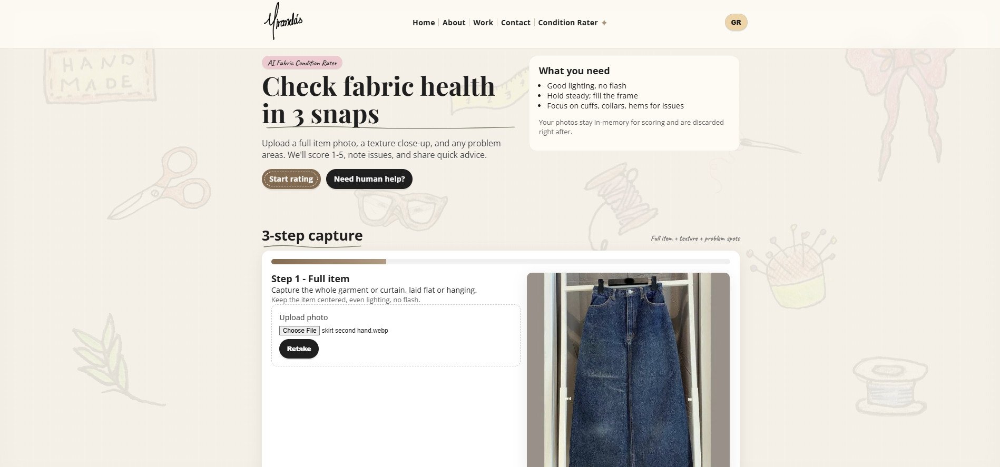

# Mirandas ⁓ AI Fabric Condition Rater

A lightweight, no-build static website for Mirandas, available in English and Greek, with an AI-powered Fabric Condition Rater wizard.

Live:

- Website: https://mirandas.gr
- AI Fabric Condition Rater: https://mirandas.gr/condition



## What it does

The condition rater asks the user for three fabric photos:

1. Full item photo
2. Texture close-up
3. Problem area photo

It then returns a fabric condition result with:

- score from 1 to 5
- confidence
- detected issues
- whether repair may be needed
- care or next-step advice

Supported item types:

- clothing
- curtain
- other fabric

Non-fabric items are refused or returned without a score.

## Tech stack

- Frontend: vanilla HTML, CSS, and JavaScript
- Backend: Cloudflare Worker
- AI: OpenAI vision model
- Bot protection: Cloudflare Turnstile
- Optional storage/rate limiting: Cloudflare KV / R2 depending on deployment

## Project structure

```txt
static/                  Static website and condition rater UI
static/index.html        Main website
static/condition.html    Fabric condition rater page
static/condition.js      Condition rater wizard logic
worker.js                Cloudflare Worker API
wrangler.toml.example    Example Worker configuration
README.md                Project documentation
```

## API

### `POST /api/evaluate`

Evaluates the condition of a fabric item.

Request type:

```txt
multipart/form-data
```

Expected fields:

```txt
photo1                  Full item photo
photo2                  Texture close-up
photo3                  Problem area photo
itemType                clothing | curtain | other fabric
lang                    Optional: el | en
cf-turnstile-response   Cloudflare Turnstile token
```

Example response:

```json
{
  "score": 4,
  "stage": 4,
  "label": "Ready to wear",
  "confidence": 0.68,
  "confidence_label": "medium",
  "issues": ["Minor fading"],
  "issues_detected": ["Minor fading"],
  "repair_needed": false,
  "advice": "Light wash and you are set.",
  "notes": "Light wash and you are set."
}
```

### `POST /api/contact`

Handles contact form submissions.

Depending on the Worker environment, contact submissions may use:

- `CONTACT_KV`
- `CONTACT_UPLOADS`
- `ADMIN_TOKEN`

## Run locally: frontend only

To preview the static website without the AI Worker, serve the `static/` folder with any simple static file server.

Using Node:

```bash
npx serve static
```

Then open the local URL shown in the terminal, usually:

```txt
http://localhost:3000
```

Or using Python:

```bash
cd static
python3 -m http.server 8080
```

Then open:

```txt
http://localhost:8080
```

This only serves the frontend. The AI condition rater needs the Cloudflare Worker API to be running or deployed separately.

## Run locally: frontend + Worker

Install Wrangler if needed:

```bash
npm install -g wrangler
```

Run the Worker locally:

```bash
wrangler dev worker.js
```

In another terminal, serve the frontend with Node:

```bash
npx serve static
```

Or with Python:

```bash
cd static
python3 -m http.server 8080
```

For local integration, either proxy `/api/evaluate` to the Worker or deploy the Worker and test against the live route.

## Deploy on Cloudflare

1. Create a Cloudflare Worker.
2. Deploy `worker.js`.
3. Add the required secrets and bindings.
4. Route the API paths to the Worker.

Required secrets:

```txt
AI_API_KEY
TURNSTILE_SECRET
```

Recommended bindings / vars:

```txt
CONTACT_KV
CONTACT_UPLOADS
ADMIN_TOKEN
EVALUATE_RATE_LIMIT_KV
EVALUATE_RATE_LIMIT_MAX
EVALUATE_RATE_LIMIT_WINDOW_SEC
```

The Worker handles:

```txt
/api/evaluate
/api/contact
/api/contact/list
/api/contact/get
/api/contact/file
```

## Privacy & safety

- Images are compressed in the browser before upload.
- Evaluation images are processed for scoring and are not persisted by the Worker.
- Contact form uploads may be stored only if the relevant Cloudflare storage binding is configured.
- Super important: API keys and secrets must never be committed to the repository.

Do not upload sensitive personal information.

## Notes

This project is intentionally simple and fun: no build step, no framework, and no client-side dependency chain.