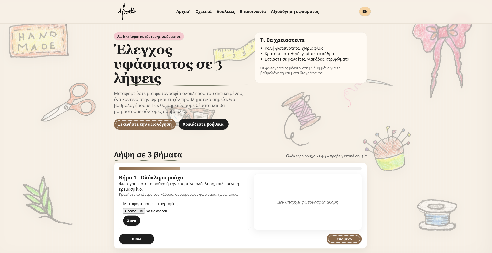

# Miranda ⁓ Static site + AI Fabric Condition Rater

A lightweight, no-build static website (EN/EL) plus an **AI Fabric Condition Rater** wizard.

Live:
- Website: https://mirandas.gr
- AI Fabric Condition Rater: https://mirandas.gr/condition



- Frontend: vanilla **HTML/CSS/JS**
- Backend: **Cloudflare Worker** (`worker.js`) exposing `POST /api/evaluate`
- AI: OpenAI vision model (key via `AI_API_KEY` (OpenAI API key))

In static/condition.js, have API_BASE default to "" (same origin), but allow override via query param or a small config file (e.g. static/config.js ignored by git).

Request: POST /api/evaluate accepts multipart/form-data with fields full, texture, problem (or whatever you use)

Response: { score: 1-5, confidence: 0-1, issues: [...], advice: [...] }

## Project structure
- `static/` — website + wizard (open directly or serve)
- `worker.js` — Cloudflare Worker backend for `/api/evaluate`

## Run locally (frontend only)
Serve the `static/` folder with any simple server (recommended so file uploads work cleanly):

```bash
cd static
python3 -m http.server 8080
```

Open **locally**:
- `http://localhost:8080/index.html`
- `http://localhost:8080/condition.html`

If no backend is available, the wizard shows an error.

## Deploy the Worker (Cloudflare)
1. Create a Worker and paste `worker.js`.
2. Set `AI_API_KEY` as a Worker environment variable/secret.
3. Set `TURNSTILE_SECRET` as a Worker environment variable/secret (used by `/api/contact` and `/api/evaluate`).
4. Configure rate limiting for `/api/evaluate`:
   - KV binding: `EVALUATE_RATE_LIMIT_KV` (recommended) or reuse `CONTACT_KV`.
   - Vars: `EVALUATE_RATE_LIMIT_MAX` (default 20), `EVALUATE_RATE_LIMIT_WINDOW_SEC` (default 60).
5. Route `*/api/evaluate` to the Worker so the static wizard can call it.

Front-end Turnstile widgets use the site key set in:
- `static/index.html` (contact form)
- `static/condition.html` (condition rater)

## Privacy & safety
- The wizard compresses images in-browser before upload.
- The Worker processes images in-memory and does not persist them.
- No API keys are included in this repository.

**Do not upload sensitive personal info.**


## Run locally (frontend + worker)

# frontend
cd static
python3 -m http.server 8080

# worker (example)
# wrangler dev
