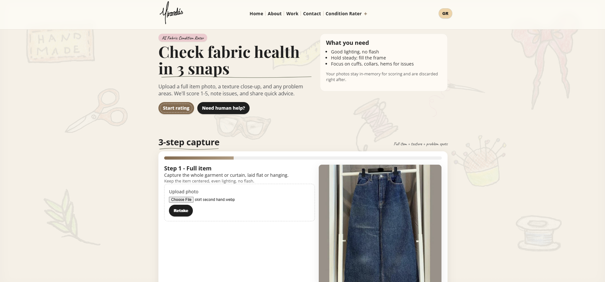

# Mirandas ⁓ AI Fabric Condition Rater

A lightweight, no-build static website for Mirandas, available in English and Greek, with an AI-powered Fabric Condition Rater wizard.

Live:

- Website: https://mirandas.gr
- AI Fabric Condition Rater: https://mirandas.gr/condition



## What it does

The condition rater asks the user for three fabric photos:

1. Full item photo
2. Texture close-up
3. Problem area photo

It then returns a fabric condition result with:

- score from 1 to 5
- confidence
- detected issues
- whether repair may be needed
- care or next-step advice

Supported item types:

- clothing
- curtain
- other fabric

Non-fabric items are refused or returned without a score.

## Tech stack

- Frontend: vanilla HTML, CSS, and JavaScript on Cloudflare Pages (`miranda-52w`)
- Backend: Cloudflare Worker
- AI: OpenAI vision model
- Bot protection: Cloudflare Turnstile
- Optional storage/rate limiting: Cloudflare KV / R2 depending on deployment

## Project structure

```txt
static/                  Static website and condition rater UI
static/index.html        Main website
static/condition.html    Fabric condition rater page
static/condition.js      Condition rater wizard logic
worker.js                Cloudflare Worker API
wrangler.toml.example    Example Worker configuration
README.md                Project documentation
```

## API

### `POST /api/evaluate`

Evaluates the condition of a fabric item.

Request type:

```txt
multipart/form-data
```

Expected fields:

```txt
photo1                  Full item photo
photo2                  Texture close-up
photo3                  Problem area photo
itemType                clothing | curtain | other fabric
lang                    Optional: el | en
cf-turnstile-response   Cloudflare Turnstile token
```

Example response:

```json
{
  "score": 4,
  "stage": 4,
  "label": "Ready to wear",
  "confidence": 0.68,
  "confidence_label": "medium",
  "issues": ["Minor fading"],
  "issues_detected": ["Minor fading"],
  "repair_needed": false,
  "advice": "Light wash and you are set.",
  "notes": "Light wash and you are set."
}
```

### `POST /api/contact`

Handles contact form submissions.

Contact messages require `CONTACT_KV`; submissions with photos also require `CONTACT_UPLOADS`. Missing storage returns an error instead of a false success. `ADMIN_TOKEN` protects retrieval:

- `CONTACT_KV`
- `CONTACT_UPLOADS`
- `ADMIN_TOKEN`

## Run locally: frontend only

To preview the static website without the AI Worker, serve the `static/` folder with any simple static file server.

Using Node:

```bash
npx serve static
```

Then open the local URL shown in the terminal, usually:

```txt
http://localhost:3000
```

Or using Python:

```bash
cd static
python3 -m http.server 8080
```

Then open:

```txt
http://localhost:8080
```

This only serves the frontend. The AI condition rater needs the Cloudflare Worker API to be running or deployed separately.

## Run locally: frontend + Worker

Install Wrangler if needed:

```bash
npm install -g wrangler
```

Run the API Worker separately using the existing local production configuration:

```bash
wrangler dev --local --port 8788
```

Run a Pages preview in another terminal:

```bash
wrangler pages dev static --port 8787
```

The Pages preview serves the website and applies `_redirects`; it does not run the separate API Worker. The browser regression script mocks `/api/*`. For manual end-to-end local testing, use a local reverse proxy that sends `/api/*` to port 8788 and all other paths to port 8787. AI evaluation and Turnstile require valid secrets/tokens; automated checks use mocks. A generic static server is useful for file previews but does not reproduce Pages clean URLs or redirects.

## Phone reveal release

Follow [DEPLOYMENT.md](DEPLOYMENT.md) exactly: deploy and configure the backward-compatible API Worker first, verify it, then publish Pages through the existing master-branch integration. Do not push frontend changes before Stage A passes. The new private Worker secret is `PHONE_NUMBER`; never store its value in this repository or Pages. Business JSON-LD deliberately omits the telephone field.

## Existing Cloudflare deployment

- Pages project **`miranda-52w`** publishes **`static/`**. The existing production Git branch triggers automatic Pages deployments when pushed.
- In Workers & Pages ? `miranda-52w` ? Settings ? Build configuration, the expected settings are: framework preset **None**, root directory **repository root**, build command **blank** (or `exit 0`), build output directory **`static`**. Preserve the existing production branch and Git integration. These dashboard values are not controlled by the API Worker's `wrangler.toml`.
- Both Pages custom domains and their proxied CNAMEs to `miranda-52w.pages.dev` remain unchanged.
- Worker **`mirandas`** handles only **`mirandas.gr/api/*`** and **`www.mirandas.gr/api/*`**. Keep these existing routes; do not add catch-all routes, Worker custom domains or a static-assets binding.
- The gitignored `wrangler.toml` keeps the production KV/R2 bindings and logging configuration. Only its migration-specific `[assets]` block was removed. Never copy the example over it. Secrets remain in the existing Worker configuration.
- A future Pages Git deployment publishes the site; it does not deploy changes to this separate Worker. Publish the API Worker separately through the existing process when deployment is authorized.

The local checks verify that `static/` is a complete Pages output directory. Read-only production checks on 2026-09-20 found both HTTPS homepages returning 200, HTTP apex redirecting to HTTPS apex (301), and `/condition.html` redirecting to `/condition` (308). No hostname redirect was observed. No authenticated dashboard inspection was available, so the saved build output directory and production branch still require confirmation; no dashboard setting was changed.

Expected public responses after the next authorized Pages deployment:

| Requested URL | Pages response |
| --- | --- |
| `/` | 200, `static/index.html` |
| `/robots.txt` | 200, `static/robots.txt` |
| `/sitemap.xml` | 200, `static/sitemap.xml` |
| `/epidiorthosi-tzin.html` | 308 to `/epidiorthosi-tzin`, then 200 |
| `/metapoiiseis-rouxon.html` | 308 to `/metapoiiseis-rouxon`, then 200 |
| `/metapoiiseis-nyfikou.html` | 308 to `/metapoiiseis-nyfikou`, then 200 |
| `/condition` | 200, `static/condition.html` (existing legacy URL) |
| `/condition.html` | 308 to `/condition`, then 200 |
| `/condition/` | 301 to `/condition`, then 200 |
| `/index.html` | Native Pages redirect to `/` |
| `/index`, `/index/` | 301 to `/` through `static/_redirects` |
| Unknown page | 404 using `static/404.html`, preventing SPA fallback to the homepage |

The other existing article URLs follow the same `.html` ? extensionless behavior. Query strings survive these redirects. CSS, JavaScript and images retain their existing URLs. Pages owns every static response; the API Worker has no role in resolving these paths.

Required secrets:

```txt
AI_API_KEY
TURNSTILE_SECRET
```

Recommended bindings / vars:

```txt
CONTACT_KV
CONTACT_UPLOADS
ADMIN_TOKEN
EVALUATE_RATE_LIMIT_KV
EVALUATE_RATE_LIMIT_MAX
EVALUATE_RATE_LIMIT_WINDOW_SEC
```

The Worker handles:

```txt
/api/evaluate
/api/contact
/api/contact/list
/api/contact/get
/api/contact/file
```

## Privacy & safety

- Images are compressed in the browser before upload.
- Evaluation images are processed for scoring and are not persisted by the Worker.
- Contact form uploads require the Cloudflare R2 storage binding. Invalid or excessive uploads are rejected instead of silently discarded.
- Super important: API keys and secrets must never be committed to the repository.

Do not upload sensitive personal information.

## Notes

This project is intentionally simple and fun: no build step, no framework, and no client-side dependency chain.

## SEO and local enquiries

- Canonical hostname: `https://mirandas.gr`; homepage: `/`. Canonical tags, Open Graph URLs, JSON-LD and sitemap URLs use the apex and native Pages extensionless paths. Internal page links use the same canonical paths relative to the current origin, so Pages previews and same-origin form submissions work. Both hostnames currently serve the site; canonical tags consolidate the preferred hostname without requiring a redirect. No hostname redirect is implemented in the API Worker or `_redirects`.
- Sitemap: https://mirandas.gr/sitemap.xml — all seven indexable HTML pages, without invented modification dates.
- Robots: https://mirandas.gr/robots.txt — public pages/assets are crawlable; `/api/` is disallowed. This is crawler guidance, not access control; admin API authentication is unchanged.
- Service guides: `/epidiorthosi-tzin`, `/metapoiiseis-rouxon`, `/metapoiiseis-nyfikou` (the `.html` entry URLs continue to work through Pages redirects). All are linked from the homepage, included in the sitemap, and link to contact and relevant services.
- Every indexable page has a unique Greek title/description, canonical URL and sharing metadata. Existing denim and condition-rater imagery is used where relevant; no new preview-image asset is invented.
- Homepage JSON-LD uses Schema.org `LocalBusiness`, with weekday hours (09:00–15:00 and 17:00–21:00, Monday–Friday). The street number supplied by the owner completes the previously partial address: **Αυλώνος 88, Σεπόλια, Αθήνα, Ελλάδα**. No conflicting street number was found. The editorial article uses `BlogPosting` without inferred dates or an unconfirmed author identity.
- Greek is useful in the initial HTML. Existing Greek/English switching remains on the same URL; therefore there is no hreflang. Proper language SEO later requires separate, stable URLs serving each language directly, with self-canonicals and reciprocal hreflang. The three service guides use the same persistent Greek/English selection; Greek remains present in the initial HTML.
- After a scored condition result, the customer can transfer a concise item/score/issues summary into the contact form. The draft stays in the current tab's `sessionStorage`, is consumed on arrival, and expires after 30 minutes. The customer reviews/edits it and submits through the existing Turnstile-protected form. Photos are not transferred. If browser storage is blocked, the result offers a copy/paste fallback.
- Contact submissions currently go to the Worker's configured storage; there is no automatic email-notification integration in this repo. Keep a working process for checking enquiries through the authenticated admin endpoints.

Deployment details: use native [Pages HTML routing](https://developers.cloudflare.com/pages/configuration/serving-pages/) and [`static/_redirects`](https://developers.cloudflare.com/pages/configuration/redirects/) for legacy trailing-slash and index aliases. Redirecting clean paths back to `.html` would loop against Pages' automatic normalization. `404.html` prevents unknown URLs from receiving the homepage with a 200 status. No Pages Functions or Workers Static Assets are required. Business schema follows the [LocalBusiness vocabulary](https://schema.org/LocalBusiness).

External setup after deployment:

1. Verify the domain in Google Search Console, submit `https://mirandas.gr/sitemap.xml`, and inspect the homepage plus each service URL.
2. Keep the Google Business Profile name, full address, telephone and hours consistent with the website. Check that the map pin is correct.
3. Ask actual customers for honest reviews after completed work, without incentives or filtering requests by expected rating. Add confirmed official profile links only when supplied.
4. Check the deployed robots/sitemap response types, redirects and schema using Search Console and Google's Rich Results Test. Monitor real enquiries, indexed pages and mobile performance after publishing.

TODO business/editorial facts: confirm postal code, weekend/holiday hours and official social profiles before adding them. Reconfirm the existing telephone and weekday schedule with the owner if they have changed. Confirm the article's author and original publication date before adding those fields. No prices, turnaround promises, reviews, ratings or additional business facts have been invented.

TODO image provenance: `static/assets/images/denim_after.webp` visibly carries a "T-Bud Co. Creative" watermark. Confirm permission/attribution and whether the gallery depicts Miranda's own work before deploying; the repository does not establish those facts. Do not remove the watermark or describe third-party examples as completed customer work.

### Remaining Cloudflare dashboard work (not performed)

No DNS, custom-domain or Worker-route changes are required. Confirm the Pages build output is `static`, with the root at the repository root and the existing production branch selected, as described above; change the output setting only if it differs.

Optional hostname consolidation: canonical tags already select the apex. If a permanent `www` redirect is desired, configure **zone `mirandas.gr` ? Rules ? Redirect Rules ? Single Redirect**:

- Custom filter: `(http.host eq "www.mirandas.gr" and not starts_with(http.request.uri.path, "/api/"))`.
- Dynamic target expression: `concat("https://mirandas.gr", http.request.uri.path)`.
- Status code: **301**; **Preserve query string: enabled**.

First check Redirect Rules, Bulk Redirects and legacy Page Rules for an apex-to-`www` redirect; do not enable opposite rules together. The read-only public checks found no such redirect, but do not establish every dashboard rule. Keep the existing HTTP-to-HTTPS behavior. Excluding `/api/*` preserves POST bodies, preflights and authenticated retrieval on both existing Worker routes. Do not create this redirect inside the API Worker. See Cloudflare's [dynamic redirect parameters](https://developers.cloudflare.com/rules/url-forwarding/single-redirects/settings/).

Retain the existing Turnstile hostname permissions, secrets, KV/R2 bindings and API cache exclusions. No change to these is required by this patch.

Local verification (Python 3.11+ and Node; no dependency installation):

```bash
python scripts/check-seo.py
node scripts/check-worker.mjs
node --check worker.js
node --check static/main.js
node --check static/condition.js
node --check static/nav-active.js
```

The SEO check covers tag nesting, IDs, unique H1s and heading order, metadata, JSON-LD syntax, local files/fragment links, CSS assets, robots rules, sitemap coverage, service discovery, Pages redirects/404 handling and separation from Worker configuration. The Worker check mocks Turnstile, AI and storage to verify that static paths return 404 from the Worker, API calls work on both hostnames without redirects, and API gates, admin retrieval, rate limiting, contact/photo persistence and missing-storage failures remain intact. There is no framework build or lint configuration in this repository.

With `wrangler pages dev static --port 8787` running, run `node scripts/check-pages.mjs`. This uses the real Pages local runtime to verify GET/HEAD responses, the exact HTML and asset contents, `.html` and legacy redirects with query strings, and 404 responses. It checks that API paths are not implemented by the static preview; `check-worker.mjs` validates the separate API.

Optional browser regression checks: with `wrangler pages dev static --port 8787` running and an existing Playwright installation plus Chrome, run `node scripts/check-browser.cjs`. If Playwright is installed elsewhere, set `PLAYWRIGHT_MODULE` to its module directory. The script installs nothing and checks five viewport sizes, keyboard/skip-link behavior, language switching, contact retry, condition-summary transfer and blocked storage. It mocks external requests, including the Turnstile widget's dimensions. Both forms use Turnstile's compact size to fit narrow mobile layouts. Real production Turnstile/AI credentials and Cloudflare dashboard rules must still be checked separately.

Additional refinement checks with the local Pages preview running and Playwright available:

```powershell
node scripts/check-refinements.cjs
```

This covers both languages, shared navigation, service-guide copy, image ratios, content-link styling, guide links, phone mocks (success, missing secret, invalid response, network failure, retries and repeated clicks), map opt-in, and the no-JavaScript contact fallback. Set `REVIEW_DIR` to a local directory outside `static/` to save review screenshots.
